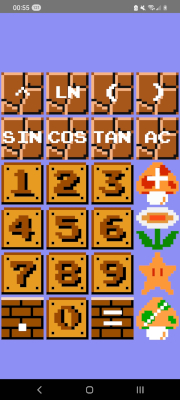
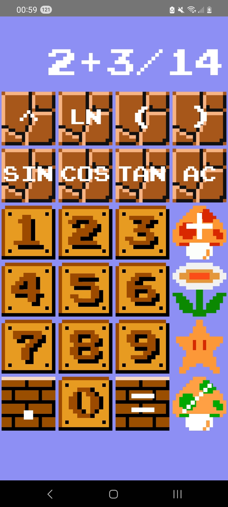
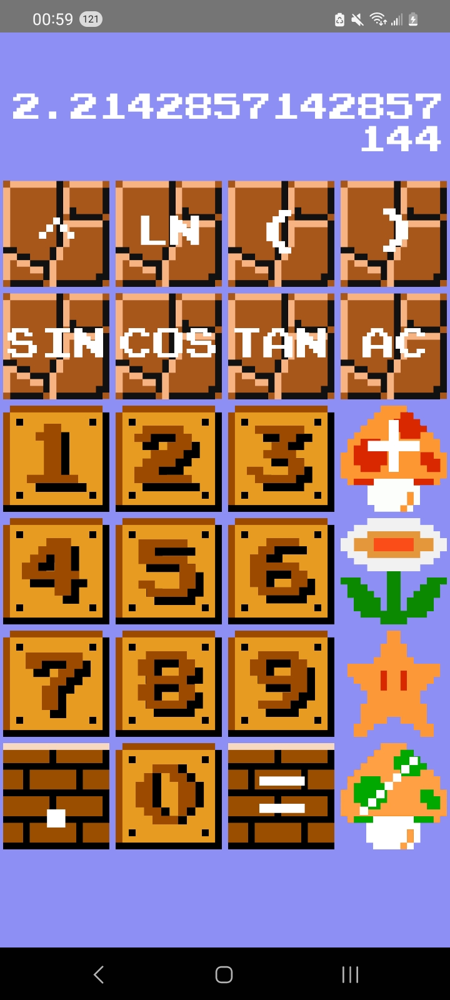
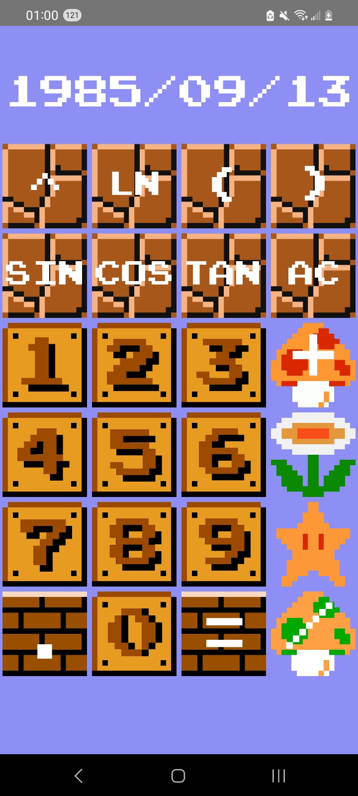

# Super Mario Bros. Calculator 
A Super Mario-style Android app calculator.  
Mario games were a large part of my childhood, so I thought nothing would be cooler than to have a Mario-themed calculator on my phone. Each button on the calculator is based on a sprite from the iconic 1985 release, Super Mario Bros. It uses the Mario-style font, and the user can toggle the Mario theme song in the background by long pressing the bottom of the screen.  
The code for the app was written in Kotlin, and was made using JetBrain's Android Studio IDE. In terms of functionality, the calculator can perform floating-point addition, subtraction, multiplication, division, with support for parentheses and order-of-operations. It can also calculate exponents, primary trigonometric functions, and the natural logarithm. As such, the calculator can be used to compute any elementary mathematical operation or function.  

Here is a video showcasing the app in action: 
<a href="https://youtu.be/BatlEBHACFI" target="blank">https://youtu.be/BatlEBHACFI</a> 

Some sample screenshots of the app running on a Samsung S20 phone:

<!---->

# Installation 
There are multiple ways you can install the app:
## 1. Google Play Store  
&nbsp;&nbsp;&nbsp;&nbsp;App will soon be published on the Google Play Store, where you can download from there  
&nbsp;&nbsp;&nbsp;&nbsp;<a href="https://play.google.com/store/apps/details?id=jmuszka.apps.mariocalculator&hl=en&gl=US" target="blank">https://play.google.com/store/apps/details?id=jmuszka.apps.mariocalculator&hl=en&gl=US</a>  
&nbsp;&nbsp;&nbsp;&nbsp;*screenshot of Google Play Store*  
## 2. My website
&nbsp;&nbsp;&nbsp;&nbsp;App is hosted on my website, from which you can directly download the APK  
&nbsp;&nbsp;&nbsp;&nbsp;Here is a link to the download page: 
&nbsp;&nbsp;&nbsp;&nbsp;<a href="http://jmuszka.com/calculator" target="blank">jmuszka.com/calculator</a>  
&nbsp;&nbsp;&nbsp;&nbsp;  
&nbsp;&nbsp;&nbsp;&nbsp;Click <a href="https://www.androidauthority.com/how-to-install-apks-31494/" target="blank">here</a> for a tutorial for manually installing APK files, if you are unfamiliar with how to do so.  
## 3. APKMirror 
&nbsp;&nbsp;&nbsp;&nbsp;App will soon be uploaded on APKMirror, from which you can directly download the APK  
&nbsp;&nbsp;&nbsp;&nbsp;*link to website*  
&nbsp;&nbsp;&nbsp;&nbsp;*screenshot of website*  
&nbsp;&nbsp;&nbsp;&nbsp;Click <a href="https://www.androidauthority.com/how-to-install-apks-31494/" target="blank">here</a> for a tutorial for manually installing APK files, if you are unfamiliar with how to do so.  
## 4. Build it yourself
&nbsp;&nbsp;&nbsp;&nbsp;Clone this Git repository onto your local machine, and build the APK in Android Studio or your preferred IDE  
&nbsp;&nbsp;&nbsp;&nbsp;1) 
&nbsp;&nbsp;&nbsp;&nbsp;How to clone this GitHub repository into Android Studio: 
&nbsp;&nbsp;&nbsp;&nbsp;<a href="https://www.geeksforgeeks.org/how-to-clone-android-project-from-github-in-android-studio/" target="blank">https://www.geeksforgeeks.org/how-to-clone-android-project-from-github-in-android-studio/</a>  
&nbsp;&nbsp;&nbsp;&nbsp;2) 
&nbsp;&nbsp;&nbsp;&nbsp;How to build an APK in Android Studio: 
&nbsp;&nbsp;&nbsp;&nbsp;<a href="https://www.geeksforgeeks.org/methods-of-generating-apk-of-android-application/" target="blank">https://www.geeksforgeeks.org/methods-of-generating-apk-of-android-application/</a>  
&nbsp;&nbsp;&nbsp;&nbsp;3) 
&nbsp;&nbsp;&nbsp;&nbsp;Click <a href="https://www.androidauthority.com/how-to-install-apks-31494/" target="blank">here</a> for a tutorial for manually installing APK files, if you are unfamiliar with how to do so.  
# In the future
Plans for the app after release:
## Add different themes
Currently, the app is styled after the sprites from the Overworld level theme (World 1-1) from Super Mario Bros. Eventually the user will have the option to choose which theme the app displays. This will include, but is not limited to, the Underground level theme (World 1-2), the Castle level theme (World 1-4), and the Underwater level theme (World 2-2). The themes will have the corresponding button sprites and backgrounds of their respective levels.  
Perhaps this will be implemented by adding a Swipe Touch Listener to the root Layout, which when called will stop the current Activity and open a new one, where each Activity is a different theme. The user can cycle through the themes by swiping across the screen. 
## Add horizontal support
Currently, the app is vertical-only, with a 4x6 grid of calculator buttons. Allowing the user to rotate the phone horizontally will allow for a larger button grid, meaning more potential functionality for the calculator. Perhaps a pi button, e button, factorial support, etc. 
## Bugfixing
Although the app has been rigorously tested, and all known bugs have been eliminated, it is always possible that there are unintentional features or functionality within the code. As such, I will continuously update this repository to fix any and all bugs that come to light.
